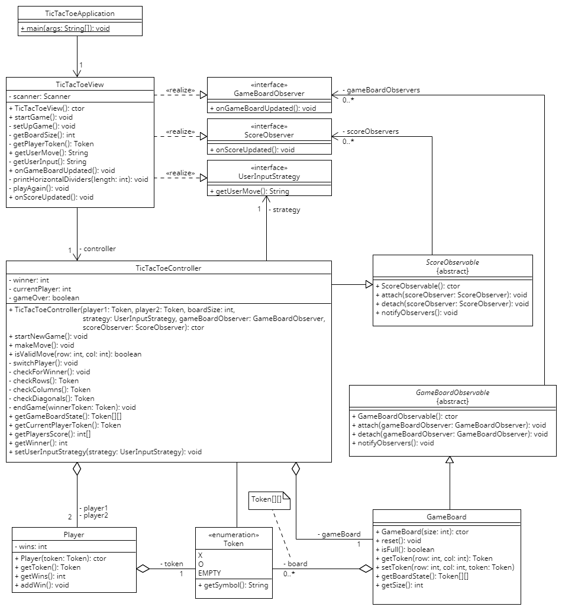

# Design

## Class Diagram
The following is a Class Diagram for the classes contained in package [is.hi.hbv202g.tictactoe](../../main/java/is/hi/hbv202g/tictactoe).

### Design Patterns
The project uses the Observer pattern twice, once for the state of the GameBoard and once for the player's scores.
 * The GameBoard extends the GameBoardObservable, and TicTacToeView implements the GameBoardObserver.
 * The TicTacToeController extends the ScoreObservable, and TicTacToeView implements the ScoreObserver.

The project also uses the Strategy pattern, where the TicTacToeController has a UserInputCallback interface that is implemented by the TicTacToeView.